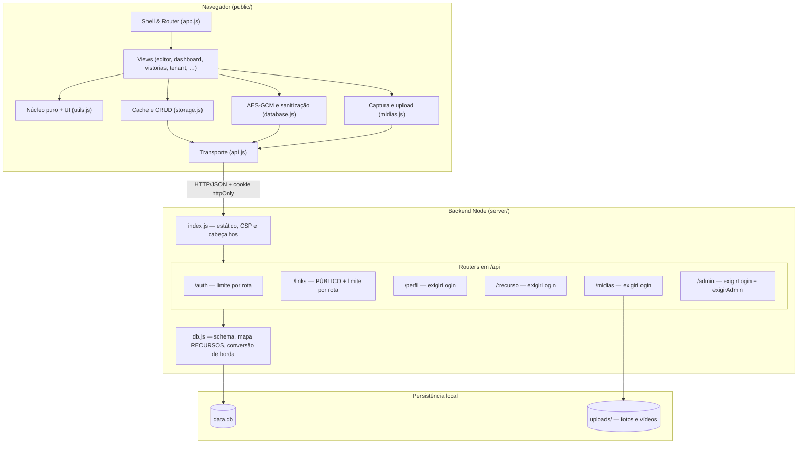
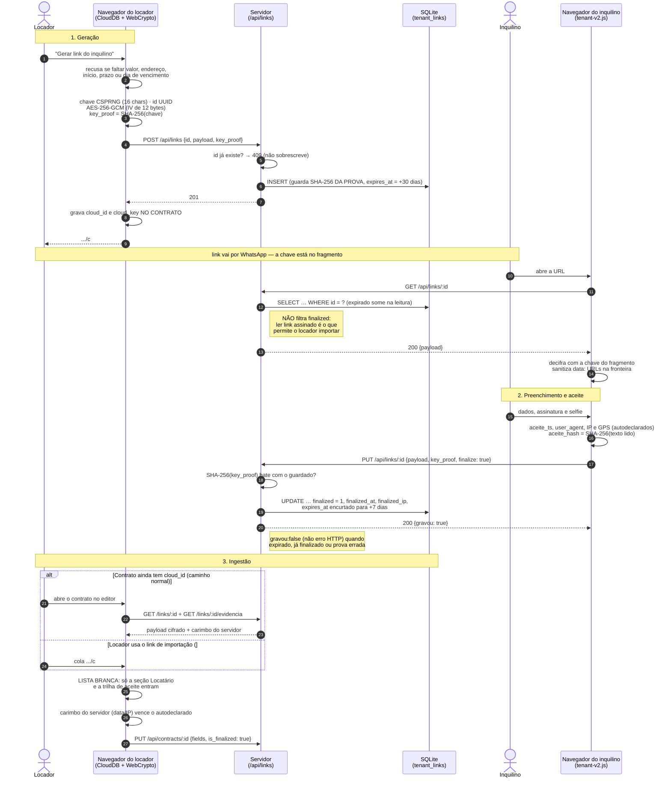
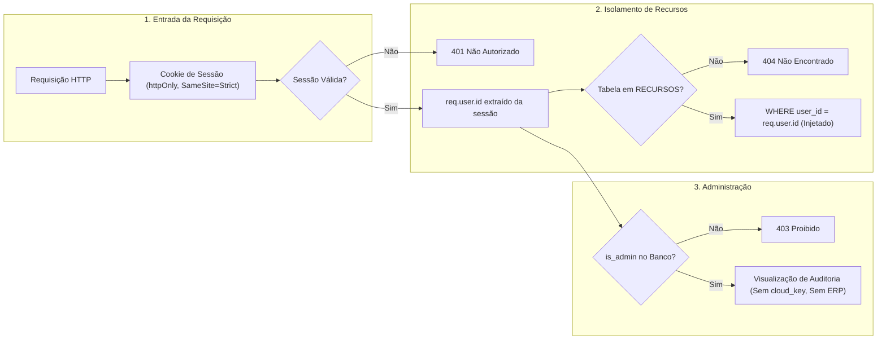
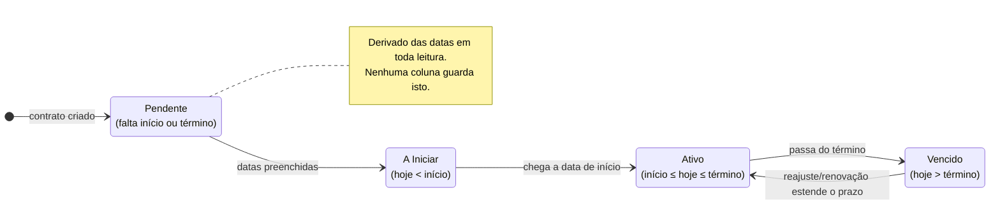
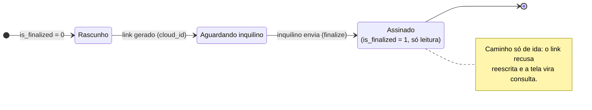
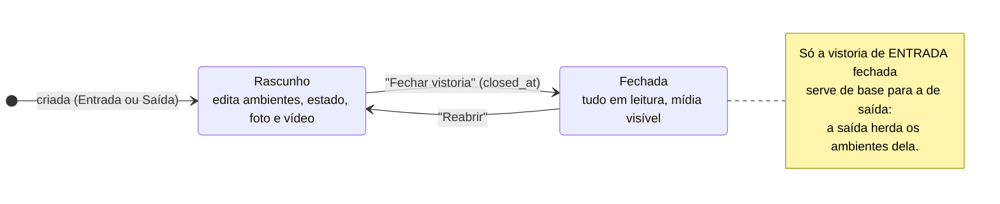

# Arquitetura do Sistema — Diagramas e Fluxos

**Versão 2.1 — 2026-08-28.** Os diagramas do sistema: camadas, o ciclo do link
do inquilino, o modelo de dados e os estados.

> **Os nomes aqui são os nomes reais das colunas e das rotas.** Diagrama que
> renomeia campo para ficar mais bonito ("title" em vez de `name`, "amount" em
> vez de `rent_value`) é pior que diagrama nenhum: quem confia nele escreve
> código que não roda, e quem descobre isso passa a não confiar em documento
> algum. A referência é `server/db.js` e `server/rotas/`; quando divergirem,
> quem está errado é este arquivo.
>
> Este documento tem irmãos: `docs/ARQUITETURA.md` (as regras e as dívidas),
> `docs/REFERENCIA.md` (regras de negócio e contrato de API) e o `CHANGELOG.md`
> (por que cada coisa é assim).

---

## 1. Camadas e comunicação

Separação de responsabilidades (R2 do `ARQUITETURA.md`): front sem build,
servidor Express, e persistência em **duas** partes — o banco em arquivo e o
diretório de mídia.

**Onde a proteção mora, e por que não é uma pilha global:** `exigirLogin` é a
**primeira linha de cada router** que precisa dele (`router.use`), não um
middleware antes de tudo — `/api/links` e `/api/auth/entrar` são públicos por
definição, e uma pilha global precisaria de exceções, que é onde o furo nasce.
O limite por IP (`limite.js`) é montado **na definição da rota**, e só nas que
podem ser marteladas: login, cadastro e as rotas públicas de link.

---

## 2. Ciclo do link do inquilino (ponta a ponta)

O servidor nunca vê o conteúdo: ele guarda bytes cifrados no navegador do
locador e decifrados no do inquilino. A chave viaja no **fragmento** da URL,
que não vai em requisição nem em `Referer`.

---

## 3. Modelo de dados

Nove tabelas em `data.db`. **Os nomes abaixo são os do `pragma table_info`.**
O escopo por conta é da aplicação, não do banco: não há RLS — quem garante é
`user_id` da sessão em todo SQL, e os testes de escopo são a cobrança disso.

```mermaid
erDiagram
    users ||--o{ sessions : "possui"
    users ||--o| profiles : "possui"
    users ||--o{ contracts : "cria"
    users ||--o{ properties : "gerencia"
    users ||--o{ clients : "cadastra"
    users ||--o{ financial_records : "lança"
    users ||--o{ inspections : "realiza"
    users ||--o{ tenant_links : "gera"
    inspections ||--o{ midias : "documenta"

    users {
        TEXT id PK "UUID do servidor — o cliente não escolhe identidade"
        TEXT email UK "collate nocase"
        TEXT senha_hash "scrypt"
        TEXT salt "16 bytes por usuário"
        INTEGER is_admin "a primeira conta nasce 1"
        TEXT criado_em "ISO-8601"
        TEXT ultimo_login "ISO-8601"
    }

    sessions {
        TEXT token PK "cookie httpOnly, SameSite=Strict"
        TEXT user_id FK "users(id) ON DELETE CASCADE"
        TEXT expira_em "30 dias; expirada some na leitura"
    }

    profiles {
        TEXT id PK "É users(id) — não há coluna user_id"
        TEXT profile_data "JSON: o perfil do locador"
        TEXT updated_at "ISO-8601"
    }

    contracts {
        TEXT id PK "gerado no cliente"
        TEXT user_id FK "users(id) ON DELETE CASCADE"
        TEXT name "nome do contrato"
        TEXT template_id "locacao_residencial | comercial | simples"
        TEXT fields "JSON: partes, valores, prazo, assinaturas, trilha"
        INTEGER is_finalized "1 = assinado, vira só leitura"
        TEXT cloud_id "id do tenant_links — o vínculo com o link"
        TEXT cloud_key "chave AES do link (em claro: dívida aberta)"
        TEXT created_at "imutável no upsert"
        TEXT updated_at "carimbado pelo servidor"
    }

    properties {
        TEXT id PK "gerado no cliente"
        TEXT user_id FK "users(id) ON DELETE CASCADE"
        TEXT name "identificação do imóvel"
        TEXT address "endereço; cep, type, area e valores em colunas próprias"
        TEXT status "manual; Alugado é DERIVADO de contrato ativo"
        REAL rent_value "aluguel de referência"
    }

    clients {
        TEXT id PK "gerado no cliente"
        TEXT user_id FK "users(id) ON DELETE CASCADE"
        TEXT name "nome"
        TEXT document "CPF/CNPJ — SEM unique; a dedupe é do app"
        TEXT client_type "Inquilino | Locador | Fiador"
        TEXT person_type "PF | PJ"
    }

    financial_records {
        TEXT id PK "gerado no cliente"
        TEXT user_id FK "users(id) ON DELETE CASCADE"
        TEXT contract_id "vínculo lógico — sem FK"
        REAL rent_value "valor do aluguel"
        REAL fee_value "taxa de administração"
        REAL net_payout "repasse ao locador"
        TEXT due_date "dia do contrato, nunca antes do início"
        TEXT status "Pendente | Pago — Atrasado é DERIVADO"
        TEXT paid_at "quando foi marcado como pago"
    }

    inspections {
        TEXT id PK "gerado no cliente"
        TEXT user_id FK "users(id) ON DELETE CASCADE"
        TEXT property_id "vínculo lógico com properties(id)"
        TEXT contract_id "contrato ativo do imóvel, quando há"
        TEXT tipo "Entrada | Saída"
        TEXT status "Rascunho | Fechada"
        TEXT inspected_on "data da vistoria"
        TEXT rooms "JSON: [{nome, estado, obs}]"
        TEXT closed_at "carimbo do fechamento"
    }

    midias {
        TEXT id PK "UUID do servidor"
        TEXT user_id FK "users(id) ON DELETE CASCADE"
        TEXT inspection_id FK "inspections(id) ON DELETE CASCADE"
        INTEGER ambiente "índice POSICIONAL dentro de rooms"
        TEXT tipo "foto | video"
        TEXT mime "image/jpeg, video/webm, …"
        INTEGER bytes "8 MB foto, 25 MB vídeo"
        TEXT arquivo "nome em uploads/ — decidido pelo SERVIDOR"
    }

    tenant_links {
        TEXT id PK "UUID do CSPRNG do cliente"
        TEXT created_by FK "users(id) — NÃO se chama user_id"
        TEXT encrypted_payload "AES-256-GCM, até 512 KB"
        TEXT key_proof "SHA-256 DA PROVA que o cliente manda"
        INTEGER finalized "caminho só de ida"
        TEXT finalized_at "carimbo do servidor, fora do payload"
        TEXT finalized_ip "req.ip — não sai de X-Forwarded-For"
        TEXT expires_at "30 dias; 7 depois de assinado"
    }
```

**Três armadilhas que o diagrama esconde:**

1. **`ambiente` é índice posicional.** Remover um ambiente do meio de `rooms`
   desloca os seguintes — por isso existe `POST /api/midias/reindexar`.
2. **`contracts.fields` é o blob central**, e nele moram assinatura e selfie em
   base64: ~53 KB por contrato, baixados **todos** a cada login. É a dívida de
   escala mais concreta do sistema.
3. **Vínculos lógicos sem FK**: contrato→imóvel (`fields.property_id`),
   `financial_records.contract_id`, e cliente↔contrato por CPF/CNPJ. Apagar um
   imóvel não limpa nada disso.

---

## 4. Pilares de Segurança & Isolamento Multiusuário

---

## 5. Ciclo de Vida: Contrato e Vistoria

Os dois estados que o sistema **deriva** e os que ele **grava** — a distinção
importa: estado derivado nunca envelhece, estado gravado envelhece se ninguém
atualizar.

### 5.1 Contrato

O quadrado de cima é **derivado das datas** a cada render (`Utils.getContractStatus`):
não existe coluna de status no banco, e é por isso que ele nunca mente. O de
baixo é **gravado** (`is_finalized`) e só anda uma vez.

### 5.2 Vistoria

**Por que a saída depende do fechamento da entrada:** enquanto a entrada é
rascunho, a lista de ambientes ainda pode mudar. Herdar de uma lista instável
faria os dois lados da comparação divergirem — e a comparação é a razão de a
vistoria existir.
