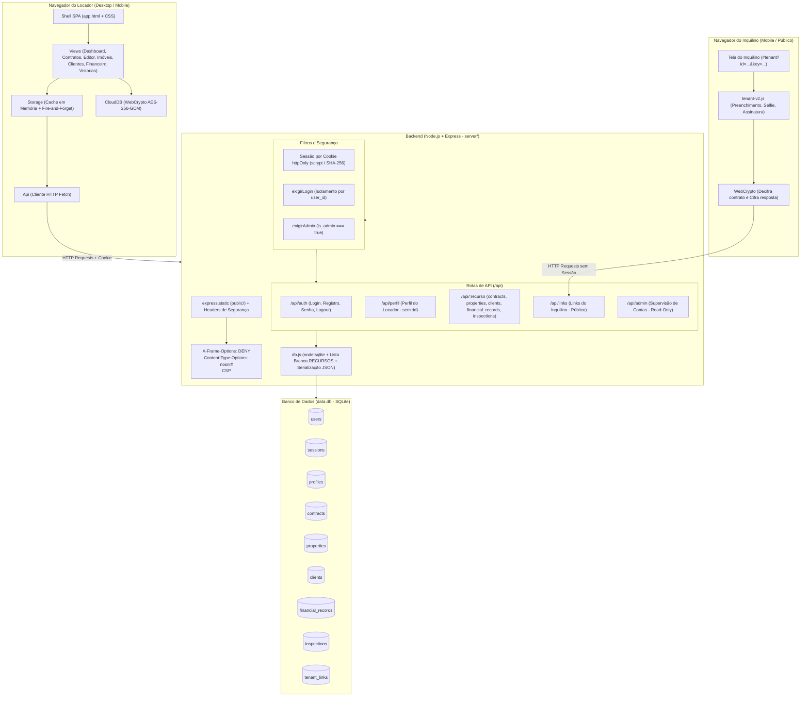
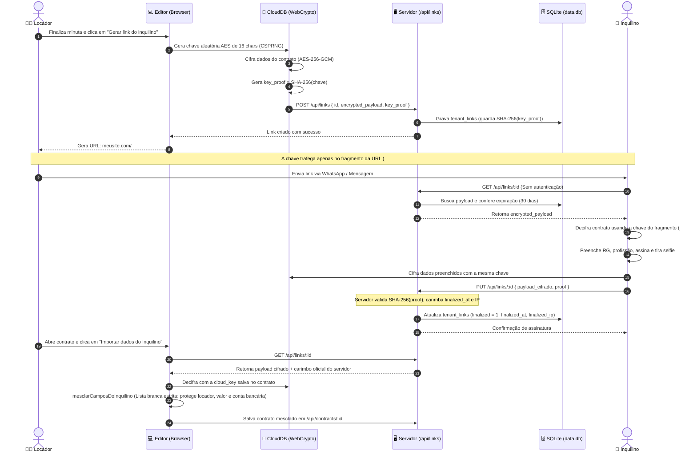
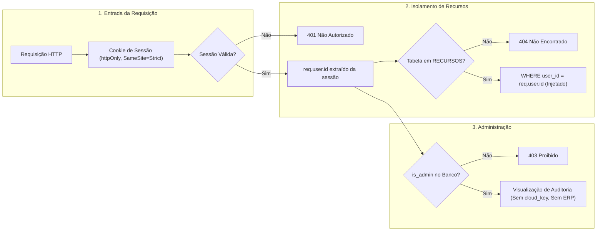
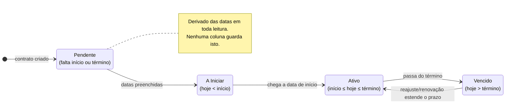
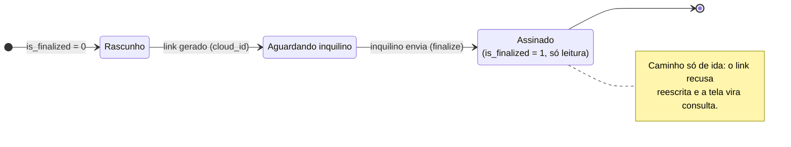
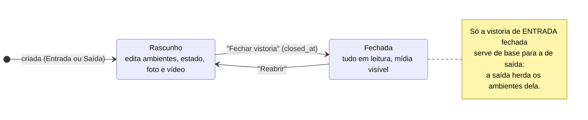

# Arquitetura do Sistema — Meus Imóveis (Área-51)

Documento executivo e técnico com os diagramas visuais e mapeamento de componentes da aplicação.

---

## 1. Visão Geral da Arquitetura (Visão em Camadas)

---

## 2. Fluxo do Inquilino & Criptografia Ponta a Ponta

Este é o fluxo mais crítico do sistema: o contrato é protegido de modo que o servidor armazena os dados cifrados sem conhecer o conteúdo legível durante o trânsito do link.

---

## 3. Modelo de Dados e Relacionamentos (SQLite)

```mermaid
erDiagram
    users ||--o{ sessions : "possui"
    users ||--|| profiles : "possui"
    users ||--o{ contracts : "cria"
    users ||--o{ properties : "gerencia"
    users ||--o{ clients : "cadastra"
    users ||--o{ financial_records : "lança"
    users ||--o{ inspections : "realiza"
    users ||--o{ tenant_links : "gera"
    inspections ||--o{ midias : "documenta"

    users {
        text id PK "UUID do servidor"
        text email UK "E-mail único"
        text senha_hash "scrypt + salt"
        text salt "16 bytes aleatórios"
        integer is_admin "0 ou 1"
        text criado_em "ISO-8601"
        text ultimo_login "ISO-8601"
    }

    sessions {
        text token PK "Token da sessão"
        text user_id FK "users.id"
        text expira_em "ISO-8601 (7 dias)"
        text created_at "ISO-8601"
    }

    profiles {
        text id PK "users.id (sem parâmetro :id na rota)"
        text profile_data "JSON com dados do locador"
        text updated_at "ISO-8601"
    }

    contracts {
        text id PK "UUID gerado no cliente"
        text user_id FK "users.id"
        text name "Título do contrato"
        text template_id "locacao_residencial, etc."
        text fields "JSON: partes, imóvel, valores, assinaturas"
        text cloud_id "ID do tenant_link gerado"
        text cloud_key "Chave AES para decifrar"
        integer is_finalized "0 ou 1"
        text created_at "ISO-8601 imutável"
        text updated_at "ISO-8601"
    }

    properties {
        text id PK "UUID do cliente"
        text user_id FK "users.id"
        text title "Nome/Identificação"
        text address "Endereço completo"
        real rent_value "Valor numérico do aluguel"
        text status "Disponível ou Alugado (derivado)"
    }

    clients {
        text id PK "UUID do cliente"
        text user_id FK "users.id"
        text name "Nome do cliente"
        text document "CPF ou CNPJ"
        text client_type "Locador ou Locatário"
    }

    financial_records {
        text id PK "UUID do cliente"
        text user_id FK "users.id"
        text contract_id "Vínculo lógico com contracts.id"
        real rent_value "Valor do aluguel"
        real fee_value "Taxa de administração"
        real net_payout "Repasse líquido ao locador"
        text due_date "Vencimento: dia do contrato, nunca antes do início"
        text status "Pendente ou Pago (Atrasado é derivado)"
    }

    inspections {
        text id PK "UUID do cliente"
        text user_id FK "users.id"
        text property_id "Vínculo com o imóvel"
        text tipo "Entrada ou Saída"
        text rooms "JSON: [{nome, estado, obs}]"
        text status "Rascunho ou Fechada"
        text closed_at "Carimbo do fechamento"
    }

    midias {
        text id PK "UUID do servidor"
        text user_id FK "users.id"
        text inspection_id FK "inspections.id (cascata)"
        integer ambiente "Índice posicional dentro de rooms"
        text tipo "foto ou video"
        text mime "image/jpeg, video/webm, ..."
        integer bytes "Tamanho do arquivo"
        text arquivo "Nome em uploads/ — decidido pelo SERVIDOR"
    }

    tenant_links {
        text id PK "UUID do cliente"
        text created_by FK "users.id (nome real da coluna)"
        text encrypted_payload "Blob cifrado (AES-GCM <= 512KB)"
        text key_proof "SHA-256(SHA-256(chave))"
        integer finalized "0 ou 1 (só de ida)"
        text finalized_at "Carimbo UTC pelo servidor"
        text finalized_ip "IP capturado pelo servidor"
        text expires_at "Data de expiração (30 dias)"
    }
```

---

## 4. Pilares de Segurança & Isolamento Multiusuário

---

## 5. Ciclo de Vida: Contrato e Vistoria

Os dois estados que o sistema **deriva** e os que ele **grava** — a distinção
importa: estado derivado nunca envelhece, estado gravado envelhece se ninguém
atualizar.

### 5.1 Contrato

O quadrado de cima é **derivado das datas** a cada render (`Utils.getContractStatus`):
não existe coluna de status no banco, e é por isso que ele nunca mente. O de
baixo é **gravado** (`is_finalized`) e só anda uma vez.

### 5.2 Vistoria

**Por que a saída depende do fechamento da entrada:** enquanto a entrada é
rascunho, a lista de ambientes ainda pode mudar. Herdar de uma lista instável
faria os dois lados da comparação divergirem — e a comparação é a razão de a
vistoria existir.
